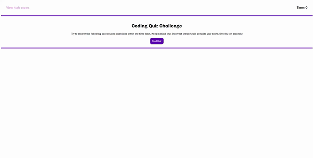

# Module 4 - Coding Quiz

## Description 
This is a coding quiz, you answer the question wrong you lose time from your timer, there is a highscore tab, if you want to clear the highscores hit 'Clear Scores'.
<h1 align="center">
    <a href="https://mickeyphillips.github.io/CodeQuiz-MP/" target="_blank">
        Coding Quiz
    </a>
</h1>

    

